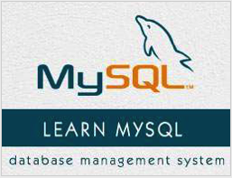

```
Roberto Nogueira  
BSd EE, MSd CE
Solution Integrator Experienced - Certified by Ericsson
```
# TutorialsPoint project



**About**

Learn everything you need to about the subject of this `Tutorialspoint` project.

[Homepage](https://www.tutorialspoint.com/mysql/index.htm)

## Topics
```
Learn MySQL
[ ] Home
[ ] Introduction
[ ] Installation
[ ] Administration
[ ] PHP Syntax
[ ] Connection
[ ] Create Database
[ ] Drop Database
[ ] Select Database
[ ] Data Types
[ ] Create Tables
[ ] Drop Tables
[ ] Insert Query
[ ] Select Query
[ ] Where Clause
[ ] Update Query
[ ] Delete Query
[ ] Like Clause
[ ] Sorting Results
[ ] Using Join
[ ] NULL Values
[ ] Regexps
[ ] Transactions
[ ] Alter Command
[ ] Indexes
[ ] Temporary Tables
[ ] Clone Tables
[ ] Database Info
[ ] Using Sequences
[ ] Handling Duplicates
[ ] SQL Injection
[ ] Database Export
[ ] Database Import
MySQL Useful Resources
[ ] Useful Functions
[ ] Quick Guide
[ ] Useful Resources
[ ] Discussion
Selected Reading
[ ] Developer's Best Practices
[ ] Questions and Answers
[ ] Effective Resume Writing
[ ] HR Interview Questions
[ ] Computer Glossary
[ ] Who is Who
```
